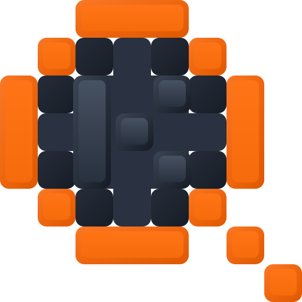

<p align="center">
  
</p>

<h1 align="center">kwiry</h1>

<p align="center">
  <strong>K</strong>nowledge <strong>W</strong>orkspace <strong>I</strong>nformation <strong>R</strong>etrieval <strong>Y</strong>oke — pronounced <em>“query”</em><br>
</p>

<p align="center">
  <a href="https://github.com/cybersader/kwiry/actions/workflows/ci.yml"></a>
  
  
  
</p>

<p align="center">
  <strong>Local-first search for the knowledge you already own.</strong><br>
  In the desktop sidecar profile, kwiry combines Tantivy BM25, fully offline ONNX embeddings, and RRF hybrid ranking in one Rust binary — nothing leaves your machine, and no cloud API is required. Point it at a supported source tree, not just an Obsidian vault, then search through its watching daemon, authenticated HTTP API, or BRAT-installable Obsidian client. Beta.15 also publishes an explicit **In-plugin · Lexical** profile using portable Rust plus official SQLite FTS5-WASM for desktops that cannot run a daemon. It supports multi-format extraction with Excel disabled by default and a disposable machine-local warm start. Property projection and grouped UX are published, while ranking, daily-drive, and distribution acceptance remain pending. Enterprise deployments use the separate OpenClast profile and its governed server-to-server boundary.
</p>

---

A single Rust binary provides:

- **Lexical search** (Tantivy BM25) over heading-split section chunks
- **Semantic search** (local ONNX embeddings, bge-small-en-v1.5, fully offline) — opt-in via `serve --semantic`
- **Hybrid ranking** (reciprocal rank fusion over both legs)
- A **watching daemon** with authenticated HTTP API, incremental hash-based updates, rename/delete correctness, and boot reconciliation for offline changes
- A **disposable index**: files are the sole source of truth; all derived state rebuilds from nothing, deterministically
- A published **In-plugin · Lexical** Obsidian profile using portable Rust and official SQLite FTS5-WASM, with supported multi-format extraction and Excel disabled by default

## Quick start

Native installers are not published yet. Build the binary from source, then use the guided setup on native Windows or Linux:

```bash
cd daemon
cargo build --release -p kwiry
./target/release/kwiry setup
```

On Windows, run `target\release\kwiry.exe setup`. The wizard asks for a tree, a stable ID, whether to enable semantic search, and final confirmation. It prepares the index, installs a least-privilege per-user background service, starts it, and verifies authenticated readiness. WSL lifecycle setup is intentionally rejected; manual development commands remain available there.

Preview an automation-safe plan without changing anything:

```bash
./target/release/kwiry setup /absolute/path/to/notes --id notes --no-semantic --dry-run --json
```

See [the setup guide](docs/setup.md) for Windows Task Scheduler behavior, Linux `systemd --user`, semantic first-run costs, JSON automation, service lifecycle commands, readiness checks, and recovery.

For development or unsupported lifecycle environments, the original explicit flow remains available:

```bash
cargo run -p kwiry -- vault add --id notes --path /absolute/path/to/notes
cargo run -p kwiry -- index
cargo run -p kwiry -- search "your query"
cargo run -p kwiry -- serve --semantic
```

## Documentation

Start with the orientation layer, then follow links to the canonical contract and delivered behavior:

- [`docs/product-map.md`](docs/product-map.md) — product vision, component relationships, trust profiles, search modes, and intended end state
- [`ROADMAP.md`](ROADMAP.md) — desktop and identity-governed delivery tracks, current review boundary, and planned sequencing
- [`CONTRACT.md`](CONTRACT.md) — binding product invariants, interfaces, and authorization commitments
- [`docs/setup.md`](docs/setup.md) — guided setup, automation, per-user service lifecycle, and recovery
- [`docs/vertical-1.md`](docs/vertical-1.md) — deterministic lexical index and query core
- [`docs/vertical-2.md`](docs/vertical-2.md) — daemon, watcher, authentication, and incremental correctness
- [`docs/vertical-3.md`](docs/vertical-3.md) — local semantic and hybrid search
- [`docs/openclast-ig1.md`](docs/openclast-ig1.md) — identity-governed OpenClast lexical gateway and operator configuration
- [`clients/obsidian/README.md`](clients/obsidian/README.md) — published Daemon and In-plugin · Lexical behavior, installation, formats, and privacy boundaries
- [`docs/design/obsidian-lite.md`](docs/design/obsidian-lite.md) — in-plugin architecture, historical feasibility gates, published beta.15 baseline, and remaining acceptance gates
- [`bench/fts5-wasm/README.md`](bench/fts5-wasm/README.md) — verified standalone official SQLite FTS5-WASM Gate 1 evidence and limitations
- [`bench/fts5-wasm-obsidian-probe/README.md`](bench/fts5-wasm-obsidian-probe/README.md) — one-file Gate 2 automation, public frozen releases, field evidence, and accepted verdict
- [`docs/roadmap/desktop-obsidian.md`](docs/roadmap/desktop-obsidian.md) — D5 status, including published property projection and grouped UX plus pending ranking/daily-drive/distribution acceptance

Serve the repository documentation and logo previews without GitHub:

```bash
./scripts/serve-docs.sh local      # localhost only
./scripts/serve-docs.sh tailnet    # direct tailnet HTTP on port 32190
./scripts/serve-docs.sh tailscale  # tailnet HTTPS mounted at /kwiry
./scripts/serve-docs.sh unmount    # remove only the /kwiry HTTPS mount
```

The HTTPS mode preserves any existing Tailscale Serve root proxy and removes its `/kwiry` mount when the session exits.

## Repository layout

| Path | Contents | License |
|---|---|---|
| `daemon/` | Rust workspace: `kwiry-core` library + `kwiry` binary | [MIT](LICENSE-MIT) OR [Apache-2.0](LICENSE-APACHE) |
| `clients/obsidian/` | Obsidian client with published Daemon and In-plugin · Lexical profiles; D5C ranking and D5D daily-drive/distribution acceptance remain pending | [GPL-3.0-only](clients/obsidian/LICENSE) |
| `fixtures/vault/` | CI fixture vault for determinism tests | MIT OR Apache-2.0 |
| `bench/` | Standalone runtime, storage, WASM feasibility, and compatibility probes | Per-package license; see each benchmark or probe |

Unless a path contains its own license notice, repository content outside `clients/obsidian/` is dual-licensed under MIT or Apache-2.0 at your option (the Rust convention; Apache-2.0 adds an express patent grant). Compatibility probes that bundle GPL-covered plugin code carry their own license. Unless you state otherwise, any contribution you submit follows the license of its target path, per Apache-2.0 §5 where applicable.

The accepted responsive logo system and preserved design archive live in [`docs/logo/`](docs/logo/README.md): the untouched mark is used at 64px and below, while the graphite-K mark is used at 96px and above.

The Obsidian plugin is GPL-3.0-only and may port code from [Omnisearch](https://github.com/scambier/obsidian-omnisearch) by Simon Cambier. Beta.15 publishes explicit Daemon and In-plugin · Lexical profiles; the latter packages portable dual-licensed Rust preparation code plus official SQLite FTS5-WASM behind the GPL plugin. No GPL plugin code moves into the daemon or core.

## Design invariants

1. Authorization precedes retrieval — candidate generation, scoring statistics, hydration, and future fusion/traversal are constrained before results exist.
2. Files are the sole source of truth — every byte of index state is derivable from the vault.
3. Explicit host profiles never fall back into one another: the desktop sidecar uses its loopback token, in-plugin lite uses a direct project-owned worker interface, and OpenClast uses short-lived signed search capabilities.
4. Presentation clients are dumb — project-owned hosts own retrieval. Native hosts use Rust adapters; constrained in-plugin mode uses portable Rust preparation/query planning plus an application-owned Worker binding fixed operations to official SQLite FTS5-WASM.
5. The engine is an implementation detail — Tantivy, official SQLite FTS5-WASM, sqlite-vec, and fastembed live behind project-owned adapters and models.
6. No algorithm authorship — scoring, ANN, tokenization, and embeddings are imported; RRF fusion is the one permitted formula.
