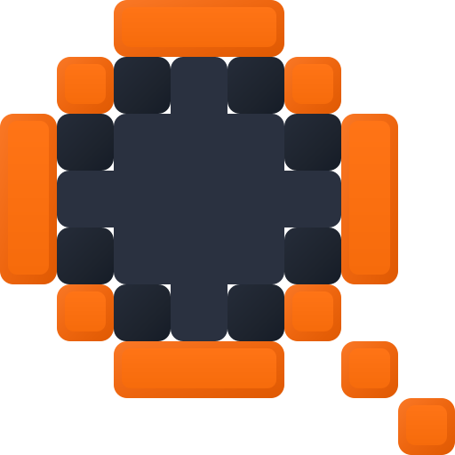

<p align="center">
  
</p>

<h1 align="center">kwiry</h1>

<p align="center">
  <strong>K</strong>nowledge <strong>W</strong>orkspace <strong>I</strong>nformation <strong>R</strong>etrieval <strong>Y</strong>eoman<br>
  <em>pronounced “query” — the trusty clerk who keeps your records searchable</em>
</p>

<p align="center">
  <a href="https://github.com/cybersader/kwiry/actions/workflows/ci.yml"></a>
  
  
  
</p>

<p align="center">
  <strong>Local-first search for the knowledge you already own.</strong><br>
  kwiry combines Tantivy BM25, fully offline ONNX embeddings, and RRF hybrid ranking in one Rust binary — nothing leaves your machine, and no cloud API is required. Point it at any Markdown or text tree, not just an Obsidian vault, then search through its watching daemon, authenticated HTTP API, or BRAT-installable Obsidian client.
</p>

---

A single Rust binary provides:

- **Lexical search** (Tantivy BM25) over heading-split section chunks
- **Semantic search** (local ONNX embeddings, bge-small-en-v1.5, fully offline) — opt-in via `serve --semantic`
- **Hybrid ranking** (reciprocal rank fusion over both legs)
- A **watching daemon** with authenticated HTTP API, incremental hash-based updates, rename/delete correctness, and boot reconciliation for offline changes
- A **disposable index**: files are the sole source of truth; all derived state rebuilds from nothing, deterministically

## Quick start

```bash
cd daemon
cargo build --workspace

# Register a tree and search it from the CLI
cargo run -p kwiry -- --config /tmp/kwiry.toml --data-dir /tmp/kwiry-data vault add --id notes --path /absolute/path/to/notes
cargo run -p kwiry -- --config /tmp/kwiry.toml --data-dir /tmp/kwiry-data index
cargo run -p kwiry -- --config /tmp/kwiry.toml --data-dir /tmp/kwiry-data search "your query"

# Run the daemon (add --semantic for semantic/hybrid modes)
cargo run -p kwiry -- --config /tmp/kwiry.toml --data-dir /tmp/kwiry-data serve --semantic
```

The daemon prints its bearer-token file path on startup. Search over HTTP:

```bash
curl -X POST http://127.0.0.1:32189/v0/search \
  -H "Authorization: Bearer $(cat /tmp/kwiry.token)" \
  -H 'Content-Type: application/json' \
  -d '{"q":"your query","mode":"hybrid","limit":20}'
```

## Documentation

- [`CONTRACT.md`](CONTRACT.md) — the frozen product contract: invariants, HTTP/MCP surface, host profiles
- [`docs/vertical-1.md`](docs/vertical-1.md) — index + query core
- [`docs/vertical-2.md`](docs/vertical-2.md) — daemon, watcher, auth, incremental correctness
- [`docs/vertical-3.md`](docs/vertical-3.md) — semantic + hybrid search

## Repository layout

| Path | Contents | License |
|---|---|---|
| `daemon/` | Rust workspace: `kwiry-core` library + `kwiry` binary | [MIT](LICENSE-MIT) OR [Apache-2.0](LICENSE-APACHE) |
| `clients/obsidian/` | Obsidian plugin (dumb client: query box + renderer + status light) | [GPL-3.0-only](clients/obsidian/LICENSE) |
| `fixtures/vault/` | CI fixture vault for determinism tests | MIT OR Apache-2.0 |
| `bench/` | Standalone benchmark crates (embedding runtime, vector store) | MIT OR Apache-2.0 |

Everything outside `clients/obsidian/` is dual-licensed under MIT or Apache-2.0 at your option (the Rust convention; Apache-2.0 adds an express patent grant). Unless you state otherwise, any contribution you submit to those paths is dual-licensed the same way, per Apache-2.0 §5.

Logo alternates live in [`docs/logo/minimal/`](docs/logo/minimal/).

The Obsidian plugin is GPL-3.0-only and may port code from [Omnisearch](https://github.com/scambier/obsidian-omnisearch) by Simon Cambier. The plugin talks to the daemon only over localhost HTTP; the daemon and core contain no GPL code.

## Design invariants

1. Files are the sole source of truth — every byte of index state is derivable from the vault.
2. One contract, many hosts — desktop sidecar today; container sidecar and WASM lite tier share the same surface later.
3. Clients are dumb — no chunking, ranking, or index logic outside the daemon.
4. The engine is an implementation detail — Tantivy, sqlite-vec, and fastembed live behind adapters.
5. No algorithm authorship — scoring, ANN, tokenization, and embeddings are imported; RRF fusion is the one permitted formula.
